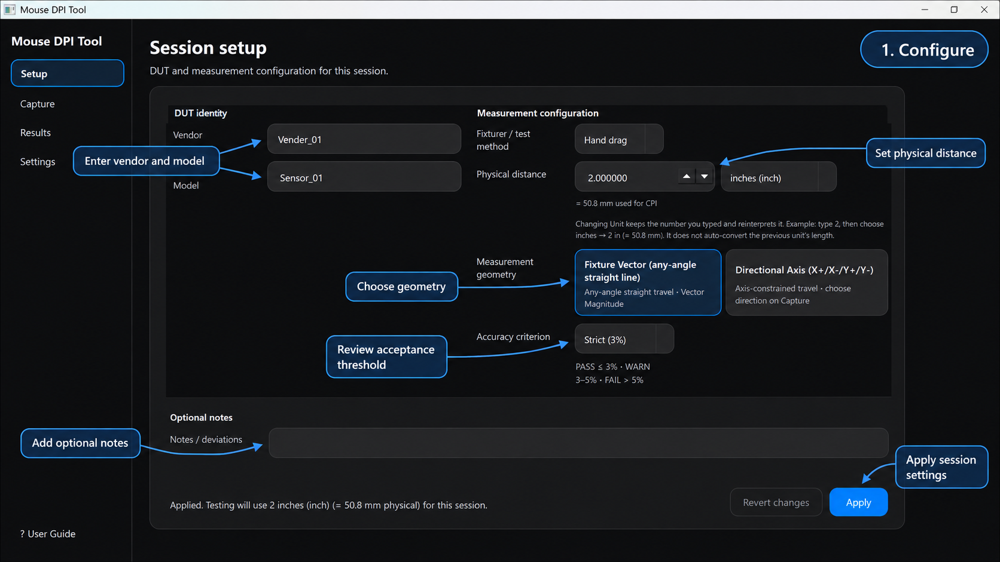
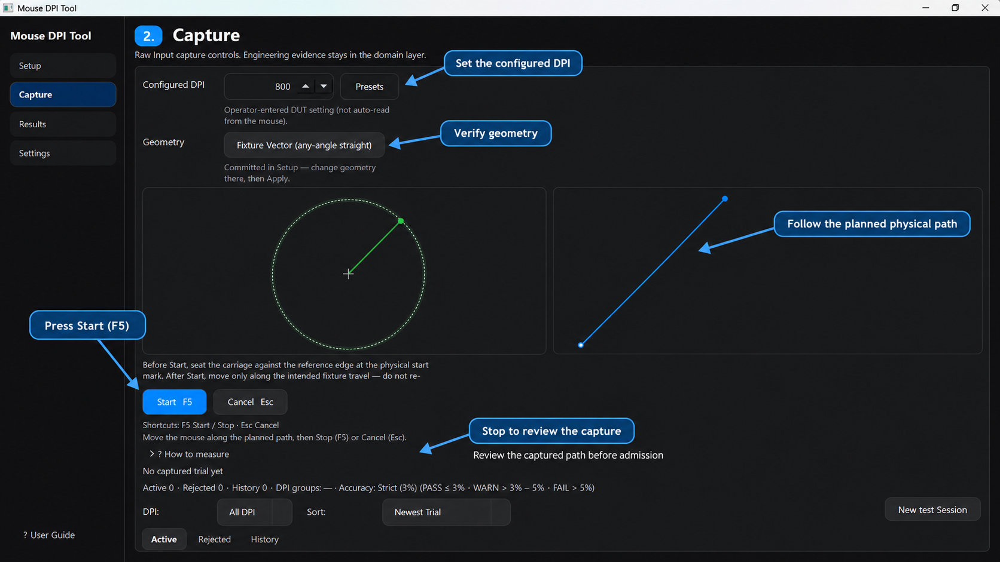
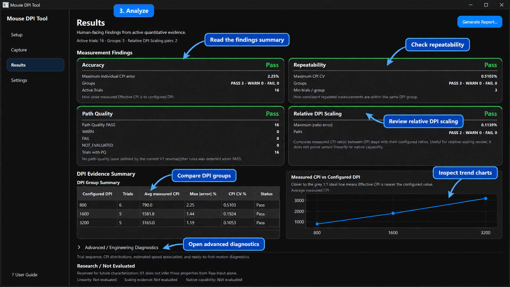

# Mouse DPI Tool

**Mouse DPI Tool** is a standalone, **vendor-neutral** Windows desktop application for
measuring mouse DPI (Effective CPI) and turning those measurements into structured
engineering evidence.

It solves a practical validation problem: given a known physical travel distance and
native Windows Raw Input counts, produce repeatable Session JSON / HTML reports with
accuracy, repeatability, path-quality, and configured-DPI scaling Findings — for any
compatible mouse / device under test (DUT), not a single manufacturer or product family.

**Current status:** `0.1.0rc1` source Release Candidate (Python + UI workflow).  
Portable binary redistribution is deferred. MIT licensed.

**Canonical report language:** English (UI may localize display labels only)

## Preview

Mouse DPI Tool follows a simple evidence workflow: configure the measurement
context, capture a controlled physical movement, then review findings across
DPI groups.

### 1. Configure

<p align="center">
  
</p>

Define the measurement context before testing:

- identify the device under test
- set the known physical travel distance
- choose the measurement geometry
- confirm the acceptance criterion
- record optional session notes

The committed setup becomes the measurement context used by subsequent
captures.

### 2. Capture

<p align="center">
  
</p>

Capture one controlled movement at a time:

- enter the configured DPI
- verify the committed geometry
- start capture with `F5`
- move across the known physical distance
- stop and review the captured evidence
- admit only a valid, complete trial

The Capture view keeps the physical measurement workflow and its evidence
visible together, including path visualization and capture state.

### 3. Analyze

<p align="center">
  
</p>

Review accumulated evidence across DPI groups:

- **Accuracy** — Effective CPI closeness to configured DPI
- **Repeatability** — within-group CPI consistency
- **Path Quality** — evaluable path evidence under the current rules
- **Relative DPI Scaling** — measured ratios between configured DPI steps
- **DPI Evidence Summary** — group-level measured CPI, error, CV, and status
- **Engineering Diagnostics** — deeper descriptive views when needed

The Results view separates human-facing Findings from descriptive engineering
analysis so that the tool does not invent a single overall product verdict.

## Measurement Method

V1 formal Effective CPI supports **two geometries** (Session `movement_mode`):

| Geometry (UI) | Storage `movement_mode` | Primary counts |
|---|---|---|
| **Fixture Vector** (default Qt operator) | `Vector Magnitude` | √(dx² + dy²) |
| **Directional Axis** | `Axis Projection` | `|dx|` or `|dy|` |

### Fixture Vector (any-angle straight line)

Known physical distance + continuous straight stroke at any angle + Raw Input net counts.
Official CPI = vector magnitude / inch. Signed X+/Y+ direction is **not** an admission gate.
Radial Target Gauge shows the expected count radius `R = DPI × physical distance (inches)`; Path Trace remains an engineering view.

### Directional Axis (engineering characterization)

Known physical distance + directional straight-line movement + Axis Projection + Raw Input counts.

For an X-direction trial, `primary_counts = |counts_x|`. For Y, `primary_counts = |counts_y|`.
Lateral motion is **not** included in the formal directional CPI numerator; it is characterized separately via axis leakage and Path Quality / straightness.

Admission is fail-closed for Axis Projection: selected direction must match signed primary Raw Input movement (Windows relative Y is positive downward, so `Y+` expects `counts_y < 0`).

Typical operator flow:

1. Enter **configured DPI**.
2. Enter the known **physical travel distance** (and unit).
3. Select **geometry** (Fixture Vector or Directional Axis). For Axis mode, select direction `X+` / `X-` / `Y+` / `Y-`.
4. Mark the same physical distance on the test surface / guide.
5. Start Capture.
6. Move the mouse as straight as practical through the **full marked physical distance**.
7. Stop Capture.
8. Review capture integrity / Path Quality / Radial Gauge (Fixture Vector) evidence.
9. Admit a **valid complete** capture as a trial (F5 admits + starts next).
10. Repeat for repeatability analysis.

Important:

- The physical marked travel distance is the measurement ground truth.
- On-screen START→TARGET guidance (Axis mode) is **direction-only**; do not treat screen/cursor travel as the CPI reference.
- Radial Target Gauge is a **target-radius** instrument, not a “draw a circle” test.
- **Effective CPI is not equivalent to native sensor capability.**

Session trials store the existing canonical pair `axis` (`X`|`Y`) and `direction` (`X+`|`X-`|`Y+`|`Y-`). Under Fixture Vector these fields are non-authoritative placeholders (`X` / `X+`); grouping still includes `movement_mode`. **Per-trial `axis` + `direction` are authoritative only for Axis Projection.** Top-level `measurement_context.direction` is non-authoritative.

## Positioning (do not overclaim)

> Mouse DPI Tool is a native Windows Raw Input application for repeatable, evidence-based Effective CPI validation and engineering characterization.

Differentiation is methodology and evidence (native Raw Input, per-device counts, capture integrity, multi-trial repeatability/CV, groups, ratios, Path Quality, Session evidence, Findings, offline desktop workflow)—not marketing claims such as “100% accurate”, “proves native sensor DPI”, or “better than browser DPI analyzers” without controlled benchmarks.

## Quick Start (Windows)

```powershell
cd <repo-root>
python -m venv .venv
.\.venv\Scripts\python.exe -m pip install -e ".[dev,ui]"
```

Then either:

- Double-click / run `RUN_Mouse_DPI_Tool.cmd` (prefers `.venv\Scripts\python.exe` when present; same entry as `python -m mouse_dpi_tool ui`)
- Or: `.\.venv\Scripts\mouse-dpi-tool.exe ui`

The launcher does **not** auto-install packages. Prefer the documented `.venv` path. If a system Python launcher is selected and the package is missing, the script prints setup instructions and exits non-zero — create/install `.venv` as above, then re-run.

```powershell
pytest
```

## Design invariants

- Standalone package only — no external shared-runtime or orchestration coupling
- Canonical DPI field: `configured_dpi` (legacy `target_dpi` is ingest-only)
- No single Overall PASS/WARN/FAIL verdict in V1 machine schema
- Path metrics owned only by `path_quality/`
- Theme / locale preferences are **not** Session engineering evidence
- Qt/UI never computes CPI, groups, ratios, or Findings status
- No Qt imports in `measurement/`, `capture/`, `path_quality/`, `session/`, `findings/`

## Public data & security

- This RC is **source-only** (no `dist/` / bundled Qt binaries in Git).
- Public fixtures and `examples/` are **synthetic**. Private qualification Sessions stay local (`reports/` is ignored).
- First-party source is released under the MIT License. Public example data is synthetic and does not contain private qualification records.
- See `SECURITY_CODEX.md`, `THREAT_MODEL.md`, `SECURITY.md`, `PUBLIC_RELEASE_CHECKLIST.md`, `THIRD_PARTY_LICENSES.md`, and `docs/SOFTWARE_VALIDATION.md`.

## Portable packaging (deferred)

For **0.1.0rc1**, the supported path is the source-based Windows workflow above.
Portable binaries are not published with this RC. Sources under `packaging/` remain
available for development and reproducibility (not a Qt/PySide redistribution claim).

```powershell
python packaging/build_windows.py
```

## Presentation preferences

- **Theme:** Light · Dark · Follow system (OS color scheme via Qt)
- **Locales (architecture):** `en-US`, `zh-TW`, `zh-CN`, `ja-JP`, `ko-KR`, `de-DE`, `fr-FR`, `es-ES`
- Core shell strings are tracked for completeness; catalogs are improving but should not yet be described as “full 8-language localization”
- Domain/schema codes (`PASS`, `ACCURACY_FAIL`, `mm`, `X+`, observation IDs, …) stay English/canonical in Session JSON

Developer maintenance (golden fixtures): see [`reference/README.md`](reference/README.md).
